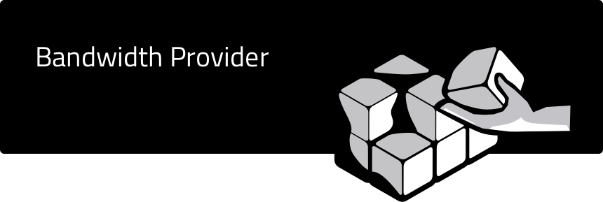

<p align="center"></p>

<div align="center">
  <h4>This is a guide to working as the Distributor Lead on the latest
    <a href="https://testnet.joystream.org/">testnet</a>.</h4><br>
</div>

Table of Contents
==
<!-- TOC START min:1 max:3 link:true asterisk:false update:true -->
  - [The Storage and Distribution System](#the-storage-and-distribution-system)
    - [Bags](#bags)
    - [Storage Buckets](#storage-buckets)
    - [Distribution Buckets](#distribution-buckets)
- [Distributor CLI](#distributor-cli)
  - [Leader](#leader)
    - [cancel-invitation](#cancel-invitation)
    - [create-bucket](#create-bucket)
    - [create-bucket-family](#create-bucket-family)
    - [delete-bucket](#delete-bucket)
    - [delete-bucket-family](#delete-bucket-family)
    - [invite-bucket-operator](#invite-bucket-operator)
    - [remove-bucket-operator](#remove-bucket-operator)
    - [set-bucket-family-metadata](#set-bucket-family-metadata)
    - [set-buckets-per-bag-limit](#set-buckets-per-bag-limit)
    - [update-bag](#update-bag)
    - [update-bucket-mode](#update-bucket-mode)
  - [update-bucket-status](#update-bucket-status)
    - [update-dynamic-bag-policy](#update-dynamic-bag-policy)
  - [Operator](#operator)
    - [accept-invitation](#accept-invitation)
    - [set-metadata](#set-metadata)
<!-- TOC END -->

## The Storage and Distribution System
Storage and Distribution system is well documented on github. A simple version will be outlined here.

### Bags
A bag is a collection of assets associated (in most cases `*`) with a single `channel`.

A single channel cannot be in two bags, and a bag can only contain one channel.

`*` Currently, we only support `dynamic` bags (`static` will be added), on the `channel` level. Channels are identified by a Channel ID (`channelId`) that is incremented by 1 for each new channel as transaction are made.

#### Creation
Whenever a new channel is created, a new "bag" is created.

If a new channel is created and given the `channelId` 1337, the new bag will be `dynamic:channel:1337`.

#### Deletion
Even if there are no assets in the bag, it will persist until the channel is deleted.

#### Modification
Every time an asset is added (eg. a video is created), the bag grows larger.
Every time an asset is removed (eg. a video is deleted), the bag shrinks.

At all times, a bag will have `n` files, with the total size of `s` bytes associated with it.

### Storage Buckets
Both the Storage and Distribution implementation uses the concept of `buckets`. A `bucket` can be populated with multiple `bags`. A bag can be held by multiple buckets, and be added/removed to/from a bucket by the Lead.

#### Creation
A Storage Bucket can only be created by the Storage Lead. A single worker can only be invited, (and thus accept) to be the operator of a single bucket at the time. Simultaneously, the Lead can not invite more than a single worker to be the operator of a single bucket. Only if the operator is removed, or the invitation is cancelled, can a new operator be invited, or the operator be invited to another bucket.

When creating them, a limit on both the number of files it can contain, and the total size of the files, must be set. If this capacity is exceeded, any new assets added will be rejected `*`.

`*` The consequence of that is that any channels whose bag is assigned to this bucket, will not be able to create new videos. It will fail on the runtime level, even if the Storage Node assigned to the bucket has the storage space to accept them, or that there are other buckets whose limits are not exceeded that also is assigned that bag.

#### Deleting or Re-assigning Storage Buckets
As long as there are any bags in a bucket, the bucket can not be deleted. And a worker that is operating a bucket can not be fired from a role, before they are removed from the bucket.

In order to delete a bucket, the Lead must first remove all the bags from it.

#### Modification
A bag can be added to, and removed from, a bucket at any time, as long as it doesn't violate some other parameter.

Note that this means a bag can be removed from all buckets, which makes it hard (if not impossible) to recover that data. Therefore, the Lead should never remove a bag from a bucket without knowing it is held (not "just" supposed to be held) by other buckets.


### Distribution Buckets
The distribution buckets work somewhat differently, as they also have the concept of `bucket families`.

#### Bucket Families
A bucket family is a collection of distribution buckets associated with a geographical region (eg. from larger to smaller: World, Europe, Norther Europe, Scandinavia, Norway, Oslo). This is meant to reduce latency when serving content.

At the time of writing, the Joystream Player picks distributors to serve content "randomly", giving much less importance to this concept. That doesn't mean they should be ignored, as it's not trivial to re-configure this in flight.

However, it's probably still more than sufficient to focus on 2-4 families for now, until the project and usage has grown significantly.

##### Creation
New bucket families are created, and it's metadata is set, by the Lead.

##### Modification
New buckets can be added to a family by the Lead.

##### Deletion
A bucket family can only be deleted if there are no buckets in it.

#### Buckets
A (distribution) buckets lives in a bucket family. Inside it, there are bags, which work identically to the bags in storage buckets.

##### Creation
When creating a new bucket, it must be added to an (existing) family.

##### Modification
A new bag that is created (`dynamic:channel:1336`) will be placed in distribution buckets according to the configurations. Suppose there are 3 families, with 3 buckets in each. Suppose the Lead has deleted the bucket family with id 2, and deleted two buckets from family 1 (for whatever reason), we may have the following (`family:index`):
- `[0:0, 0:1, 0:2  1:1, 1:3, 1:4  3:0, 3:1, 3:2]`

Suppose the system is configured (dynamic bag policy) to accept each new bag in to:
- 1 out 3 buckets in family `0`
- 2 out of 3 buckets in family `1`
- all 3 buckets in family `3`

Suppose bucket `1:3` is not accepting new bags.

Then, `dynamic:channel:1336` will be placed in to:
- 1 out of `[0:0, 0:1, 0:2]`, selected psuedo randomly
- `[1:1, 1:4]`
- `[3:0, 3:1, 3:2]`

As with Storage Buckets, the Lead can add or remove bags from bucket as they wish (assuming it doesn't violate some other constraint).

In general, the distributor node is a little more flexible than the storage node, as errors in the configuration in the former can cause permanent data loss, whereas the "worst" case scenario with the latter is some content not being served temporarily.


# Distributor CLI
## Leader
```
yarn joystream-distributor leader --help

Commands for performing Distribution Working Group leader on-chain duties (like setting distribution module limits and parameters, assigning bags and buckets etc.)

USAGE
  $ joystream-distributor leader:COMMAND

COMMANDS
  leader:cancel-invitation           Cancel pending distribution bucket operator invitation.
  leader:create-bucket               Create new distribution bucket. Requires distribution working group leader permissions.
  leader:create-bucket-family        Create new distribution bucket family. Requires distribution working group leader permissions.
  leader:delete-bucket               Delete distribution bucket. The bucket must have no operators. Requires distribution working group leader permissions.
  leader:delete-bucket-family        Delete distribution bucket family. Requires distribution working group leader permissions.
  leader:invite-bucket-operator      Invite distribution bucket operator (distribution group worker).
  leader:remove-bucket-operator      Remove distribution bucket operator (distribution group worker).
  leader:set-bucket-family-metadata  Set/update distribution bucket family metadata.
  leader:set-buckets-per-bag-limit   Set max. distribution buckets per bag limit. Requires distribution working group leader permissions.
  leader:update-bag                  Add/remove distribution buckets from a bag.
  leader:update-bucket-mode          Update distribution bucket mode ("distributing" flag). Requires distribution working group leader permissions.
  leader:update-bucket-status        Update distribution bucket status ("acceptingNewBags" flag). Requires distribution working group leader permissions.
  leader:update-dynamic-bag-policy   Update dynamic bag creation policy (number of buckets by family that should store given dynamic bag type).
```

### cancel-invitation
```
 yarn joystream-distributor leader:cancel-invitation --help

Cancel pending distribution bucket operator invitation.

USAGE
  $ joystream-distributor leader:cancel-invitation

OPTIONS
  -B, --bucketId=bucketId      (required) Distribution bucket ID in {familyId}:{bucketIndex} format.
  -c, --configPath=configPath  [default: ./config.yml] Path to config JSON/YAML file (relative to current working directory)
  -w, --workerId=workerId      (required) ID of the invited operator (distribution group worker)
  -y, --yes                    Answer "yes" to any prompt, skipping any manual confirmations

DESCRIPTION
  Requires distribution working group leader permissions.
```

#### Example
```
yarn joystream-distributor leader:cancel-invitation -B 0:1 -w 5 -y
```

#### Notes

### create-bucket
```
yarn joystream-distributor leader:create-bucket --help

Create new distribution bucket. Requires distribution working group leader permissions.

USAGE
  $ joystream-distributor leader:create-bucket

OPTIONS
  -a, --acceptingBags=(yes|no)  [default: no] Whether the created bucket should accept new bags
  -c, --configPath=configPath   [default: ./config.yml] Path to config JSON/YAML file (relative to current working directory)
  -f, --familyId=familyId       (required) Distribution bucket family id
  -y, --yes                     Answer "yes" to any prompt, skipping any manual confirmations
```

#### Example
```
yarn joystream-distributor leader:create-bucket -a yes -f 0 -y
```
Creates a new bucket:
- in family `0`
- accepts new bags
- returns the index of the bucket, eg. `1` meaning you created bucket `0:1`

#### Notes

### create-bucket-family
```
yarn joystream-distributor leader:create-bucket-family --help

  -c, --configPath=configPath  [default: ./config.yml] Path to config JSON/YAML file (relative to current working directory)
  -y, --yes                    Answer "yes" to any prompt, skipping any manual confirmations
```

#### Example
```
yarn joystream-distributor leader:create-bucket-family
```

#### Notes

### delete-bucket
```
yarn joystream-distributor leader:delete-bucket --help

Delete distribution bucket. The bucket must have no operators. Requires distribution working group leader permissions.

USAGE
  $ joystream-distributor leader:delete-bucket

OPTIONS
  -B, --bucketId=bucketId      (required) Distribution bucket ID in {familyId}:{bucketIndex} format.
  -c, --configPath=configPath  [default: ./config.yml] Path to config JSON/YAML file (relative to current working directory)
  -y, --yes                    Answer "yes" to any prompt, skipping any manual confirmations
```

#### Example
```
yarn joystream-distributor leader:delete-bucket -B 0:0 -y
```
Means you want to delete bucket `0:0`

#### Notes

### delete-bucket-family
```
yarn joystream-distributor leader:delete-bucket-family --help

Delete distribution bucket family. Requires distribution working group leader permissions.

USAGE
  $ joystream-distributor leader:delete-bucket-family

OPTIONS
  -c, --configPath=configPath  [default: ./config.yml] Path to config JSON/YAML file (relative to current working directory)
  -f, --familyId=familyId      (required) Distribution bucket family id
  -y, --yes                    Answer "yes" to any prompt, skipping any manual confirmations
```

#### Example
```
yarn joystream-distributor leader:delete-bucket-family -f 0 -y
```
Means you want to delete bucket family `0`

#### Notes


### invite-bucket-operator
```
yarn joystream-distributor leader:invite-bucket-operator --help

Invite distribution bucket operator (distribution group worker).

USAGE
  $ joystream-distributor leader:invite-bucket-operator

OPTIONS
  -B, --bucketId=bucketId      (required) Distribution bucket ID in {familyId}:{bucketIndex} format.
  -c, --configPath=configPath  [default: ./config.yml] Path to config JSON/YAML file (relative to current working directory)
  -w, --workerId=workerId      (required) ID of the distribution group worker to invite as bucket operator
  -y, --yes                    Answer "yes" to any prompt, skipping any manual confirmations

DESCRIPTION
  The specified bucket must not have any operator currently.
     Requires distribution working group leader permissions.
```

#### Example
```
yarn joystream-distributor leader:invite-bucket-operator -B 0:1 -w 0 -y
```
Means you want to invite worker `0` to operate bucket `0:1`

#### Notes

### remove-bucket-operator
```
yarn joystream-distributor leader:remove-bucket-operator --help

Remove distribution bucket operator (distribution group worker).

USAGE
  $ joystream-distributor leader:remove-bucket-operator

OPTIONS
  -B, --bucketId=bucketId      (required) Distribution bucket ID in {familyId}:{bucketIndex} format.
  -c, --configPath=configPath  [default: ./config.yml] Path to config JSON/YAML file (relative to current working directory)
  -w, --workerId=workerId      (required) ID of the operator (distribution working group worker) to remove from the bucket
  -y, --yes                    Answer "yes" to any prompt, skipping any manual confirmations

DESCRIPTION
  Requires distribution working group leader permissions.
```

#### Example
```
yarn joystream-distributor leader:remove-bucket-operator -B 0:1 -w 0 -y
```
Means you want to remove worker `0` from operating bucket `0:1`

#### Notes

### set-bucket-family-metadata
```
yarn joystream-distributor leader:set-bucket-family-metadata --help

Set/update distribution bucket family metadata.

USAGE
  $ joystream-distributor leader:set-bucket-family-metadata

OPTIONS
  -c, --configPath=configPath  [default: ./config.yml] Path to config JSON/YAML file (relative to current working directory)
  -f, --familyId=familyId      (required) Distribution bucket family id
  -i, --input=input            (required) Path to JSON metadata file
  -y, --yes                    Answer "yes" to any prompt, skipping any manual confirmations

DESCRIPTION
  Requires distribution working group leader permissions.
```

#### Example
With the example file below:
```
yarn joystream-distributor leader:set-bucket-family-metadata -f 0 -i /path/to/metadata.json -y
```
Means you want to set/update the metadata of bucket family `0`
```json
{
    "region": "eu-north-1",
    "description": "Central and northern Europe",
    "latencyTestTargets": [],
    "areas": [
        {
            "continentCode": "EU"
        }
    ]
}
```

#### Notes

### set-buckets-per-bag-limit
```
yarn joystream-distributor leader:set-buckets-per-bag-limit --help

Set max. distribution buckets per bag limit. Requires distribution working group leader permissions.

USAGE
  $ joystream-distributor leader:set-buckets-per-bag-limit

OPTIONS
  -c, --configPath=configPath  [default: ./config.yml] Path to config JSON/YAML file (relative to current working directory)
  -l, --limit=limit            (required) New limit value
  -y, --yes                    Answer "yes" to any prompt, skipping any manual confirmations
```

#### Example
```
yarn joystream-distributor leader:set-buckets-per-bag-limit -l 2
```
Means you want to restrict the number of buckets that holds a single bag to `2`

#### Notes

### update-bag
```
yarn joystream-distributor leader:update-bag --help

Add/remove distribution buckets from a bag.

USAGE
  $ joystream-distributor leader:update-bag

OPTIONS
  -a, --add=add
      [default: ] Index(es) (within the family) of bucket(s) to add to the bag

  -b, --bagId=bagId
      (required) Bag ID. Format: {bag_type}:{sub_type}:{id}.
          - Bag types: 'static', 'dynamic'
          - Sub types: 'static:council', 'static:wg', 'dynamic:member', 'dynamic:channel'
          - Id:
            - absent for 'static:council'
            - working group name for 'static:wg'
            - integer for 'dynamic:member' and 'dynamic:channel'
          Examples:
          - static:council
          - static:wg:storage
          - dynamic:member:4

  -c, --configPath=configPath
      [default: ./config.yml] Path to config JSON/YAML file (relative to current working directory)

  -f, --familyId=familyId
      (required) ID of the distribution bucket family

  -r, --remove=remove
      [default: ] Index(es) (within the family) of bucket(s) to remove from the bag

  -y, --yes
      Answer "yes" to any prompt, skipping any manual confirmations
```

#### Example
```
# Add
yarn joystream-distributor leader:update-bag -a 1 -b dynamic:channel:111 -f 0 -y

# Remove
yarn joystream-distributor leader:update-bag -r 1 -b dynamic:channel:111 -f 0 -y
```
Means you want to add/remove bag `dynamic:channel:111` to/from bucket `0:1`

#### Notes

### update-bucket-mode
```
yarn joystream-distributor leader:update-bucket-mode --help

Update distribution bucket mode ("distributing" flag). Requires distribution working group leader permissions.

USAGE
  $ joystream-distributor leader:update-bucket-mode

OPTIONS
  -B, --bucketId=bucketId      (required) Distribution bucket ID in {familyId}:{bucketIndex} format.
  -c, --configPath=configPath  [default: ./config.yml] Path to config JSON/YAML file (relative to current working directory)
  -d, --mode=(on|off)          (required) Whether the bucket should be "on" (distributing) or "off" (not distributing)
  -y, --yes                    Answer "yes" to any prompt, skipping any manual confirmations
```

#### Example
```
yarn joystream-distributor leader:update-bucket-mode -B 1:1 -d on
```
Means you want bucket `1:1` to distribute assets.

#### Notes

## update-bucket-status
```
yarn joystream-distributor leader:update-bucket-status --help

Update distribution bucket status ("acceptingNewBags" flag). Requires distribution working group leader permissions.

USAGE
  $ joystream-distributor leader:update-bucket-status

OPTIONS
  -B, --bucketId=bucketId       (required) Distribution bucket ID in {familyId}:{bucketIndex} format.
  -a, --acceptingBags=(yes|no)  (required) Whether the bucket should accept new bags
  -c, --configPath=configPath   [default: ./config.yml] Path to config JSON/YAML file (relative to current working directory)
  -y, --yes                     Answer "yes" to any prompt, skipping any manual confirmations
```

#### Example
```
yarn joystream-distributor leader:update-bucket-status -B 1:1 -a no -y
```
Means you want bucket `1:1` to accept new bags.


#### Notes


### update-dynamic-bag-policy
```
yarn joystream-distributor leader:update-dynamic-bag-policy --help

Update dynamic bag creation policy (number of buckets by family that should store given dynamic bag type).

USAGE
  $ joystream-distributor leader:update-dynamic-bag-policy

OPTIONS
  -c, --configPath=configPath  [default: ./config.yml] Path to config JSON/YAML file (relative to current working directory)
  -p, --policy=policy          [default: ] Key-value pair of {familyId}:{numberOfBuckets}
  -t, --type=(Member|Channel)  (required) Dynamic bag type
  -y, --yes                    Answer "yes" to any prompt, skipping any manual confirmations

DESCRIPTION
  Requires distribution working group leader permissions.
```

#### Example
```
yarn joystream-distributor leader:update-dynamic-bag-policy -t Channel -p 1:5 2:10 3:5
```
Means you want all *new* channels created, to be held by:
- 5 buckets from family `1`
- 10 buckets from family `2`
- 5 buckets from family `3`

#### Notes

## Operator

```
yarn joystream-distributor operator --help

Commands for performing node operator (Distribution Working Group worker) on-chain duties (like accepting bucket invitations, setting node metadata)

USAGE
  $ joystream-distributor operator:COMMAND

COMMANDS
  operator:accept-invitation  Accept pending distribution bucket operator invitation.
  operator:set-metadata       Set/update distribution bucket operator metadata.
```

### accept-invitation
```
yarn joystream-distributor operator:accept-invitation --help

Accept pending distribution bucket operator invitation.

USAGE
  $ joystream-distributor operator:accept-invitation

OPTIONS
  -B, --bucketId=bucketId      (required) Distribution bucket ID in {familyId}:{bucketIndex} format.
  -c, --configPath=configPath  [default: ./config.yml] Path to config JSON/YAML file (relative to current working directory)
  -w, --workerId=workerId      (required) ID of the invited operator (distribution group worker)
  -y, --yes                    Answer "yes" to any prompt, skipping any manual confirmations

DESCRIPTION
  Requires the invited distribution group worker role key
```

#### Example
```
yarn joystream-distributor operator:accept-invitation -B 0:1 -w 0 -y
```
Means you (worker `0`) wants to accept a pending invitation from the Lead to bucket `0:1`

#### Notes

### set-metadata
```
yarn joystream-distributor operator:set-metadata --help

Set/update distribution bucket operator metadata.

USAGE
  $ joystream-distributor operator:set-metadata

OPTIONS
  -B, --bucketId=bucketId      (required) Distribution bucket ID in {familyId}:{bucketIndex} format.
  -c, --configPath=configPath  [default: ./config.yml] Path to config JSON/YAML file (relative to current working directory)
  -e, --endpoint=endpoint      Root distribution node endpoint
  -i, --input=input            Path to JSON metadata file
  -w, --workerId=workerId      (required) ID of the operator (distribution group worker)
  -y, --yes                    Answer "yes" to any prompt, skipping any manual confirmations

DESCRIPTION
  Requires active distribution bucket operator worker role key.
```

#### Example
With the example file below:
```
yarn joystream-distributor operator:set-metadata -B 0:1 -w 0 -i /path/to/metadata.json
```
Means you (worker `0`) wants to set/update the metadata of bucket `0:1`
```json
{
  "endpoint": "https://<your.cool.url>/distributor/",
  "location": {
    "countryCode": "SG",
    "city": "Singapore",
    "coordinates": {
      "latitude": 1,
      "longitude": 104
    }
  },
  "extra": "Welcome to Joystream - Singapore branch!"
}
```
